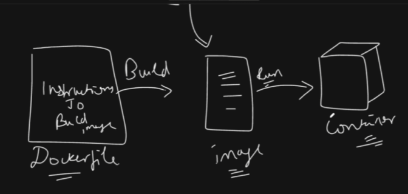

# <span style="color:red"> Docker 

- Docker is an open-source platform that 
    - automates the deployment, 
    - scaling
    - management of applications using containerization. 
- Containers are <span style="color:yellow"> lightweight, portable, and self-sufficient </span> units that package an application 
- and its dependencies together, allowing it to run consistently across different computing environments.


## Key Concepts



- **<span style="color:red"> Container</span>**: A standard unit of software that packages up code and all its dependencies so the application runs quickly and reliably from one computing environment to another.


- **<span style="color:red"> Image </span>**: A lightweight, standalone, executable package that includes everything needed to run a piece of software, including the code, runtime, libraries, environment variables, and configuration files.


- **<span style="color:red"> Dockerfile**: A text file that contains a series of instructions on how to build a Docker image.


- **<span style="color:red"> Docker Hub**: A cloud-based registry service that allows you to store and share Docker images.


- **<span style="color:red"> Volume**: A mechanism for persisting data generated by and used by Docker containers.


- **<span style="color:red"> Network**: A way to connect Docker containers to each other and to the outside world.


# <span style="color:#3bfb2b"> How To Write Docker File </span>

- A Dockerfile is a text document that contains all the commands a user could call on the command line to assemble an image. 
- Using docker build users can create an automated build that executes several command-line instructions in succession.

- if I want to create a docker file for the Spring Boot Application then the docker file will look like below 

- Use to prefer YT video

```dockerfile
# Use an official OpenJDK runtime as a parent image
FROM openjdk:11-jre-slim
# Set the working directory in the container
WORKDIR /app
# Copy the executable JAR file into the container at /app
COPY target/my-spring-boot-app.jar app.jar    
# Make port 8080 available to the world outside this container
EXPOSE 8080
# Run the JAR file
ENTRYPOINT ["java","-jar","app.jar"]
```

### Now how to run the Docker File

- To build and run the Dockerfile, follow these steps:
- 1. Open a terminal and navigate to the directory containing your Dockerfile.
  1. Build the Docker image using the following command:
     ```bash
     docker build -t my-spring-boot-app .
     ```
  2. Run a container from the image using the following command:
     ```bash
     docker run -p 8080:8080 my-spring-boot-app
     ```
     - This command maps port 8080 of the container to port 8080 on your host machine, allowing you to access the Spring Boot application via `http://localhost:8080`.
     - Make sure to replace `my-spring-boot-app` with the name you used when building the image if it's different.
     - You can stop the container by pressing `Ctrl + C` in the terminal where the container is running or by using the `docker stop` command followed by the container ID or name.
     - That's it! Your Spring Boot application should now be running inside a Docker container.
